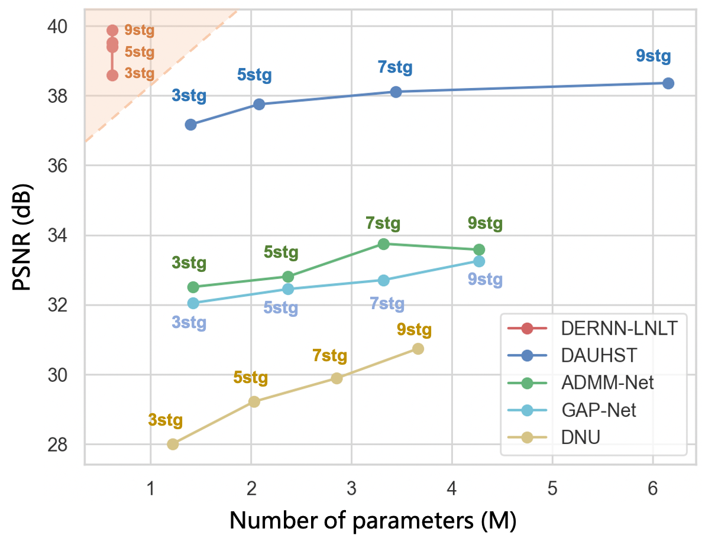
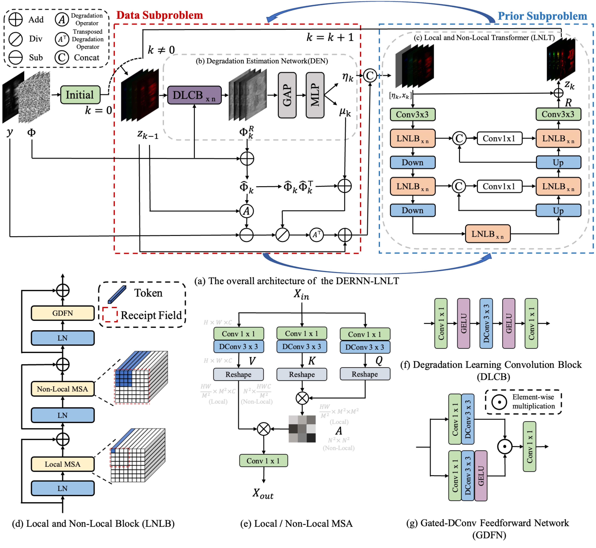

# DERNN-LNLT for CASSI

This repo is the implementation of paper "Degradation Estimation Recurrent Neural Network with Local and Non-Local Priors for Compressive Spectral Imaging"

# Abstract

In the Coded Aperture Snapshot Spectral Imaging (CASSI) system, deep unfolding networks (DUNs) have demonstrated excellent performance in recovering 3D hyperspectral images (HSI) from 2D measurements.  However,  some noticeable gaps exist between the imaging model used in DUNs and the real CASSI imaging process,  such as the sensing error as well as photon and dark current noise, compromising the accuracy of solving the data subproblem and the prior subproblem in DUNs. To address this issue, we propose a Degradation Estimation Network (DEN) to correct the imaging model used in DUNs by simultaneously estimating the sensing error and the noise level, thereby improving the performance of DUNs. Additionally, we propose an efficient Local and Non-local Transformer (LNLT) to solve the prior subproblem, which not only effectively models local and non-local similarities but also reduces the computational cost of the window-based global Multi-head Self-attention (MSA). Furthermore, we transform the DUN into a Recurrent Neural Network (RNN) by sharing parameters of DNNs across stages, which not only allows DNN to be trained more adequately but also significantly reduces the number of parameters. The proposed DERNN-LNLT achieves state-of-the-art (SOTA) performance with fewer parameters on both simulation and real datasets.


# Comparison with other Deep Unfolding Networks

<div align=center>

</div>

Comparison of PSNR-Params with previous HSI DUNs. The PSNR (in dB) is plotted on the vertical axis, while the number of parameters is represented on the horizontal axis. The proposed DERNN-LNLT outperforms the previous DUNs while requiring much fewer parameters.

# Architecture

<div align=center>

</div>

The DERNN-LNLT alternatively solves a data problem and a prior subproblem in each recurrent step. Firstly, the DERNN-LNLT unfolds the HQS algorithm within the MAP framework and transfors the DUN into an RNN by sharing parameters across stages.  Then, the DERNN-LNLT integrate the Degradation Estimation Network into the RNN, which estimates the degradation matrix for the data subproblem and the noise level for the prior subproblem by residual learning with reference to the sensing matrix. Subsequently, the Local and Non-Local Transformer (LNLT) utilizes the Local and Non-Local Multi-head Self-Attention (MSA) to effectively exploit both local and non-local HSIs priors. Finally, incorporating the LNLT into the DERNN as the denoiser for the prior subproblem leads to the proposed DERNN-LNLT.

# Usage 

## Prepare Dataset:

Download cave_1024_28 ([Baidu Disk](https://pan.baidu.com/s/1X_uXxgyO-mslnCTn4ioyNQ), code: `fo0q` | [One Drive](https://bupteducn-my.sharepoint.com/:f:/g/personal/mengziyi_bupt_edu_cn/EmNAsycFKNNNgHfV9Kib4osB7OD4OSu-Gu6Qnyy5PweG0A?e=5NrM6S)), CAVE_512_28 ([Baidu Disk](https://pan.baidu.com/s/1ue26weBAbn61a7hyT9CDkg), code: `ixoe` | [One Drive](https://mailstsinghuaeducn-my.sharepoint.com/:f:/g/personal/lin-j21_mails_tsinghua_edu_cn/EjhS1U_F7I1PjjjtjKNtUF8BJdsqZ6BSMag_grUfzsTABA?e=sOpwm4)), KAIST_CVPR2021 ([Baidu Disk](https://pan.baidu.com/s/1LfPqGe0R_tuQjCXC_fALZA), code: `5mmn` | [One Drive](https://mailstsinghuaeducn-my.sharepoint.com/:f:/g/personal/lin-j21_mails_tsinghua_edu_cn/EkA4B4GU8AdDu0ZkKXdewPwBd64adYGsMPB8PNCuYnpGlA?e=VFb3xP)), TSA_simu_data ([Baidu Disk](https://pan.baidu.com/s/1LI9tMaSprtxT8PiAG1oETA), code: `efu8` | [One Drive](https://1drv.ms/u/s!Au_cHqZBKiu2gYFDwE-7z1fzeWCRDA?e=ofvwrD)), TSA_real_data ([Baidu Disk](https://pan.baidu.com/s/1RoOb1CKsUPFu0r01tRi5Bg), code: `eaqe` | [One Drive](https://1drv.ms/u/s!Au_cHqZBKiu2gYFTpCwLdTi_eSw6ww?e=uiEToT)), and then put them into the corresponding folders of `datasets/` and recollect them as the following form:


```
|--DERNN_LNLT
    |--datasets
        |--CSI
            |--cave_1024_28
                |--scene1.mat
                |--scene2.mat
                ：  
                |--scene205.mat
            |--CAVE_512_28
                |--scene1.mat
                |--scene2.mat
                ：  
                |--scene30.mat
            |--KAIST_CVPR2021  
                |--1.mat
                |--2.mat
                ： 
                |--30.mat
            |--TSA_simu_data  
                |--mask_3d_shift.mat
                |--mask.mat   
                |--Truth
                    |--scene01.mat
                    |--scene02.mat
                    ： 
                    |--scene10.mat
            |--TSA_real_data  
                |--mask_3d_shift.mat
                |--mask.mat   
                |--Measurements
                    |--scene1.mat
                    |--scene2.mat
                    ： 
                    |--scene5.mat
    |--checkpoints
    |--csi
    |--scripts
    |--tools
    |--results
    |--Quality_Metrics
    |--visualization
```

We use the CAVE dataset (cave_1024_28) as the simulation training set. Both the CAVE (cave_1024_28) and KAIST (KAIST_CVPR2021) datasets are used as the real training set.

## Pretrained weights

Download pretrained weights ([Baidu Disk](https://pan.baidu.com/s/1BBQbFnYXx-glqYkrZ9DCSQ), code: `lnlt` | [Google Drive](https://drive.google.com/drive/folders/1aVGHRcHB2svBoYkM3pPCbZO765EXpLd8?usp=sharing)) and put them into `DERNN_LNLT/checkpoints/`

## Simulation Experiement:

### Training

```
cd DERNN_LNLT/

# DERNN-LNLT 5stage
bash ./scripts/train_dernn_lnlt_5stg_simu.sh

# DERNN-LNLT 7stage
bash ./scripts/train_dernn_lnlt_7stg_simu.sh

# DERNN-LNLT 9stage
bash ./scripts/train_dernn_lnlt_9stg_simu.sh

# DERNN-LNLT 9stage*
bash ./scripts/train_dernn_lnlt_9stg_star_simu.sh
```

The training log, trained model, and reconstrcuted HSI will be available in `DERNN_LNLT/exp/` .

### Testing

Place the pretrained model to `DERNN_LNLT/checkpoints/`

Run the following command to test the model on the simulation dataset.

```
cd DERNN_LNLT/

# DERNN_LNLT 5stage
bash ./scripts/test_dernn_lnlt_5stg_simu.sh

# DERNN_LNLT 7stage
bash ./scripts/test_dernn_lnlt_7stg_simu.sh

# DERNN_LNLT 9stage
bash ./scripts/test_dernn_lnlt_9stg_simu.sh

# DERNN_LNLT 9stage*
bash ./scripts/test_dernn_lnlt_9stg_star_simu.sh
```

The reconstrcuted HSIs will be output into `DERNN_LNLT/results/`

```
Run cal_quality_assessment.m
```

to calculate the PSNR and SSIM of the reconstructed HSIs.


### Visualization

- Put the reconstruted HSI in `DERNN_LNLT/visualization/simulation_results/results` and rename it as method.mat, e.g., DERNN_LNLT_9stg_simu.mat
- Generate the RGB images of the reconstructed HSIs

```
cd DERNN_LNLT/visualization/
Run show_simulation.m 
```


## Real Experiement:

### Training

```
cd DERNN_LNLT/

# DERNN-LNLT 5stage
bash ./scripts/train_dernn_lnlt_5stg_real.sh
```

The training log and trained model will be available in `DERNN_LNLT/exp/`

### Testing

```
cd DERNN_LNLT/

# DERNN-LNLT 5stage
bash ./scripts/test_dernn_lnlt_5stg_real.sh
```

The reconstrcuted HSI will be output into `DERNN_LNLT/results/`

### Visualization

Generate the RGB images of the reconstructed HSI

```
cd DERNN_LNLT/visualization/
Run show_real.m
```

## Acknowledgements

Our code is based on following codes, thanks for their generous open source:

- [https://github.com/ShawnDong98/RDLUF_MixS2](https://github.com/ShawnDong98/RDLUF_MixS2)
- [https://github.com/caiyuanhao1998/MST](https://github.com/caiyuanhao1998/MST)
- [https://github.com/TaoHuang95/DGSMP](https://github.com/TaoHuang95/DGSMP)
- [https://github.com/mengziyi64/TSA-Net](https://github.com/mengziyi64/TSA-Net)
- [https://github.com/facebookresearch/detectron2](https://github.com/facebookresearch/detectron2)


## Citation

If this code helps you, please consider citing our works:

```shell
@article{dernn_lnlt,
  title={Degradation Estimation Recurrent Neural Network with Local and Non-Local Priors for Compressive Spectral Imaging},
  author={Dong, Yubo and Gao, Dahua and Li, Yuyan and Shi, Guangming and Liu, Danhua},
  journal={arXiv preprint arXiv:2311.08808},
  year={2023}
}

@inproceedings{rdluf_mixs2,
  title={Residual Degradation Learning Unfolding Framework with Mixing Priors across Spectral and Spatial for Compressive Spectral Imaging},
  author={Dong, Yubo and Gao, Dahua and Qiu, Tian and Li, Yuyan and Yang, Minxi and Shi, Guangming},
  booktitle={Proceedings of the IEEE/CVF Conference on Computer Vision and Pattern Recognition},
  pages={22262--22271},
  year={2023}
}
```